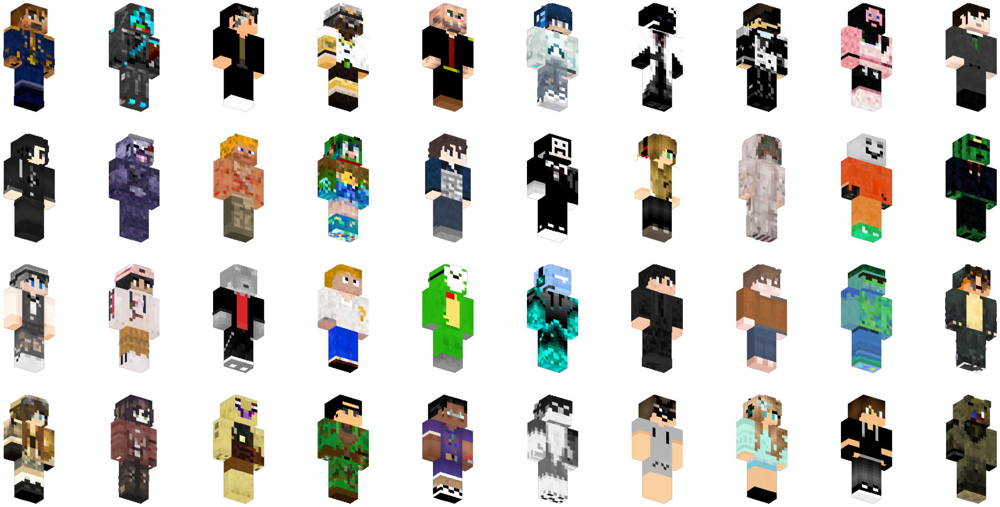

# Minecraft skins generator based on Denoising Diffusion Model
This is a Minecraft skins generator train pipeline with an unconditional denoising diffusion model from huggingface. The pipeline was built using this <a href="https://colab.research.google.com/github/huggingface/notebooks/blob/main/diffusers/training_example.ipynb#scrollTo=1aaf676d-e992-4606-9116-f0324de50772" target="_blank">tutorial notebook</a> as a reference.



# Data
The dataset was taken from <a href="https://www.kaggle.com/datasets/aryashah2k/huge-minecraft-skins-dataset" target="_blank">kaggle</a>

No augmentations were used. As preprocess all inputs were scaled between -1 and 1

# Hyperparameters
To change hyperparameters please refer to `defs.py` file.
```
IMSIZE: size of the input images for diffusion model
DEVICE: "cpu" or "cuda" 
DATA_PATH: folder with all images
SAMPLE_DIR: directory where to store generated samples
WEIGHTS_DIR: directory where to store last weights
SEED: seed for generation random images
EVALUATION_INTERVAL: how many epochs to wait to run sample generation
USE_RAM: load all images into ram before training in case you have a speed bottleneck on disk.
NUM_WORKERS: dataloader's number of workers
MIXED_PRECISION: use mixed precision. Not recomended, since experiments with mixed precision did not show any results. Might be a bug somewhere)

TRAIN_BATCH_SIZE: batch size.
EVAL_BATCH_SIZE: how many images to generate after each EVALUATION_INTERVAL epochs. It is better to use an integer that is a square of an integer.
LR: learning rages
NUM_TRAIN_TIMESTEPS: number of denoising steps
EPOCHS: number of epochs
```
# Multi GPU
If you do not specify a particular cuda device id, the pipeline will distribute the load on all of your cuda devices. It is recommended to change `CUDA_VISIBLE_DEVICES` in `start.sh` file to chose what devices to use.

Also there are files train_ddp.py and train_dp.py that uses Distributed Data Parallel and Data Parallel for multi gpu train. So you can chose between them. However, train_ddp.py is recommended.
